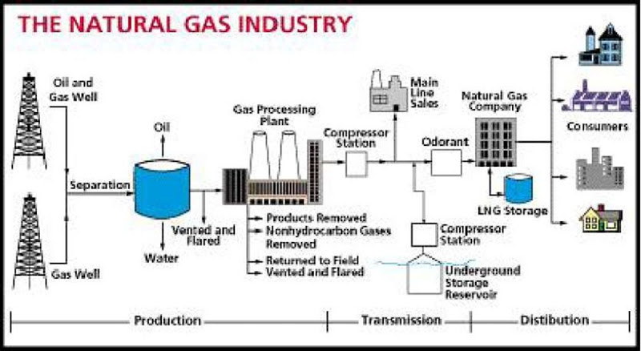

# How Natural Gas is Stored and Delivered
Natural gas is normally produced far away from the consumption regions, therefore they
requires an extensive and elaborate transportation system to reach its point of use. The
transportation system for natural gas consists of a complex network of pipeline, designed to
quickly and efficiently transport natural gas from the origin to areas of high natural gas
demand. Transportation of natural gas is closely linked with its storage since the demand of
the gas is depend on the season.
Since natural gas demand is greater in the winter, gas is stored along the way in large
underground storage systems, such as old oil and gas wells or caverns formed in old salt
beds in western country. The gas remains there until it is added back into the pipeline when
people begin to use more gas, such as in the winter to heat homes. In Malaysia, and other
tropical country, gas is supplied throughout the year, therefore it was storage in a large tank
in the processing plant, either in Bintulu, Sarawak, or at Kertih, Terengganu.
Three major types of pipeline available along the transportation route, the gathering system,
the interstate pipeline and the distribution system. The gathering system consists of low
pressure, low diameter pipelines that transport raw natural gas from the wellhead to the
processing plant. In Malaysia, the natural gas is transported from oil rig offshore to the
processing plant at Petronas Gas Berhad at Kertih, Terengganu, and Bintulu LNG Tanker,
Sarawak. Since Malaysia natural gas and other producing country contain high sulfur and
carbon dioxide (sour gaseous) it must used specialized sour gas gathering pipe. Natural wet
gas from the wellhead contain high percentage of water therefore it will react with sour
gaseous to form acids, which are extremely corrosive and dangerous, thus its transportation
from the wellhead to the sweetening plant must be done carefully. The topic will be
discussed in depth in the treatment and processing of natural gas.
Pipeline can be classified as interstate or intrastate either it carries natural gas across the
state boundary (interstate) or within a particular state (intrastate). Natural gas pipelines are
subject to regulatory oversight, which in many ways determines the manner in which
pipeline companies must operate. When the gas gets to the communities where it will be
used (usually through large pipelines), the gas is measured as it flows into smaller pipelines
called mains. Very small lines, called services, connect to the mains and go directly to homes
or buildings where it will be used. This method is used by rich country such as in the United
State, Canada or European country, such as United Kingdom, France etc.
The used of pipeline for natural gas delivery is costly, therefore some countries prefer to use
trucks for inland delivery. Using this method the natural gas should be liquefied to
minimize the size of the tanker truck. In certain country, the natural gas is transported by
trucks tankers to the end users. For example in Malaysia the natural gas was transported as
Liquefied Natural Gas (LNG) using tanker trucks to different state in peninsular of Malaysia
and in East Malaysia. The gas was supplied by Petronas Gas Berhad, at Kertih, Terengganu
while in east Malaysia, Sabah and Sarawak, the gas was supplied by Bintulu Plant. The
natural is exported by large ships equipped with several domed tanks.
When chilled to very cold temperatures, approximately -260°F, natural gas changes into a
liquid and can be stored in this form. Because it takes up only 1/600th of the space that it
would in its gaseous state, Liquefied natural gas (LNG) can be loaded onto tankers (large
ships with several domed tanks) and moved across the ocean to deliver gas to other
countries. When this LNG is received in the United States, it can be shipped by truck to be
held in large chilled tanks close to users or turned back into gas to add to pipelines. The
whole process to obtain the natural gas to the end user can be simplified by the diagram
shown in Fig.

